# trinity-workflow

A skill that bootstraps the **Trinity Workflow** in a repository, for teams that want every feature to go through a reviewed spec before implementation — but don't want to hand a raw backlog bullet straight to an AI proposal tool.

Trinity combines [OpenSpec](https://github.com/Fission-AI/OpenSpec) (spec-driven development: proposal → design → tasks, reviewed before code) with a prior step — refining the raw backlog item, in chat, with an agent tuned to the project's real stack. That refinement step is what turns an ambiguous bullet like "protected routes: guards, roles, redirects" into a requirement precise enough for a proposal to actually be good on the first pass.

This skill only runs the **setup** once per repo. It does not implement any feature.

---

## What It Does

| Step | Action |
|------|--------|
| 0 | Checks Node.js ≥ 20.19.0 (required by OpenSpec) |
| 1 | Installs the OpenSpec CLI and runs `openspec init` (Claude Code assistant) |
| 2 | Writes the real project stack/conventions into `openspec/config.yaml` |
| 3 | Asks how the team wants the backlog organized (single file, per-sprint, per-release, or custom) and sets it up |
| 4 | Creates `architect`, `backend-developer`, and `frontend-developer` agents, grounded in this repo's actual stack |
| 5 | Verifies or creates a `conventional-commit` skill |
| 6 | Documents the full 9-step Trinity flow in `CONTRIBUTING.md` |
| 7 | Adds a short pointer to Trinity in `CLAUDE.md` |
| 8 | Summarizes what was installed vs. what still needs manual review |

Never overwrites `openspec/`, the backlog, `CONTRIBUTING.md`, or `CLAUDE.md` if they already exist — shows what's there and asks how to integrate instead.

---

## Prerequisites

- Node.js ≥ 20.19.0 (OpenSpec requirement)
- Claude Code, since the day-to-day flow uses `/opsx:propose`, `/opsx:apply`, `/opsx:archive`

---

## After setup

Add the team's first real item to the backlog and start the day-to-day flow from step 1 (refine with the right agent, then `/opsx:propose`) — documented in full in the `CONTRIBUTING.md` this skill writes.

---

## Demo video

  <video src="./assets/video/trinity-workflow-demo.mp4" controls width="100%"></video>

---

## Slides

  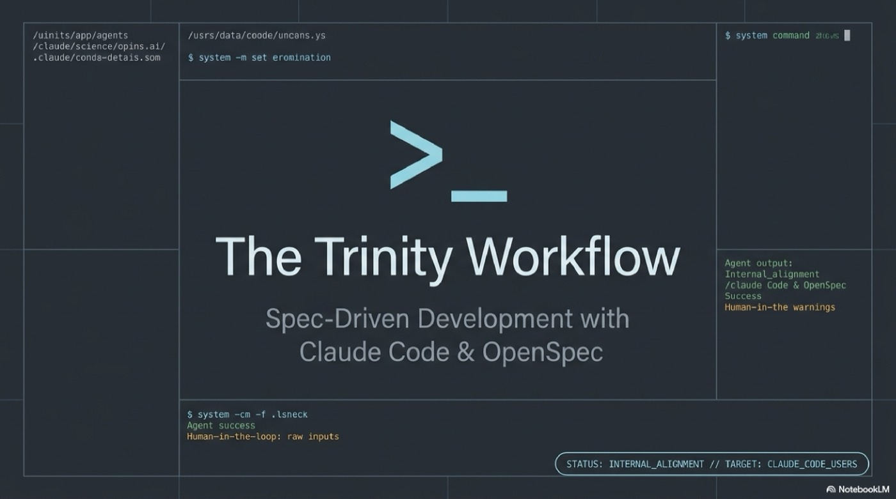

  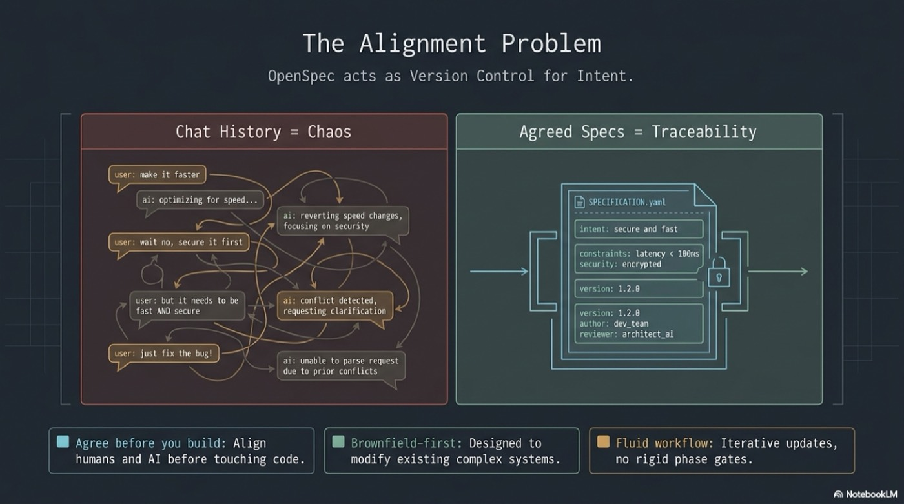

  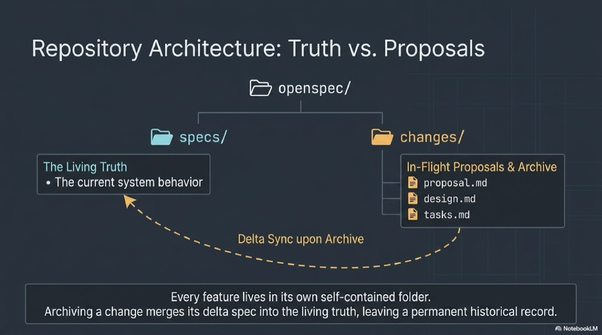

  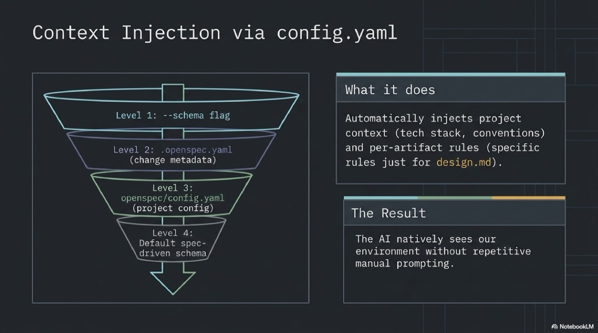

  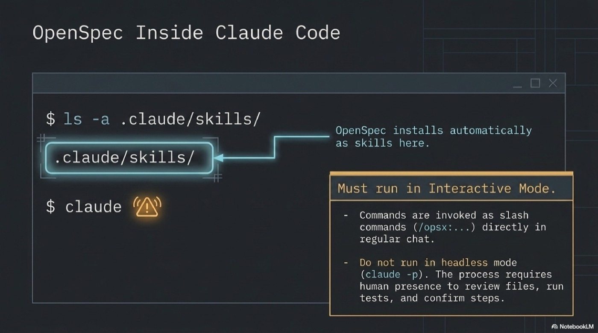

  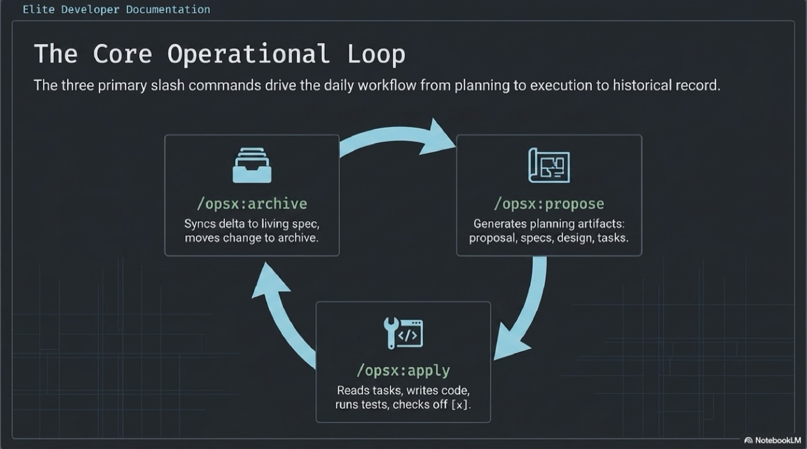

  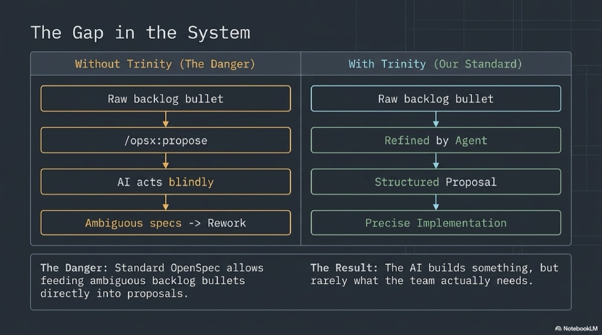

  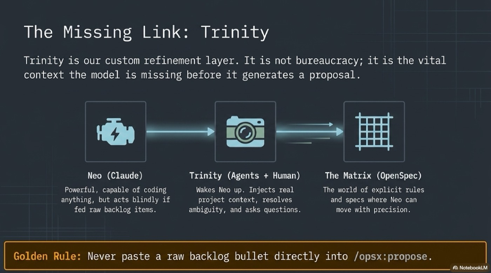

  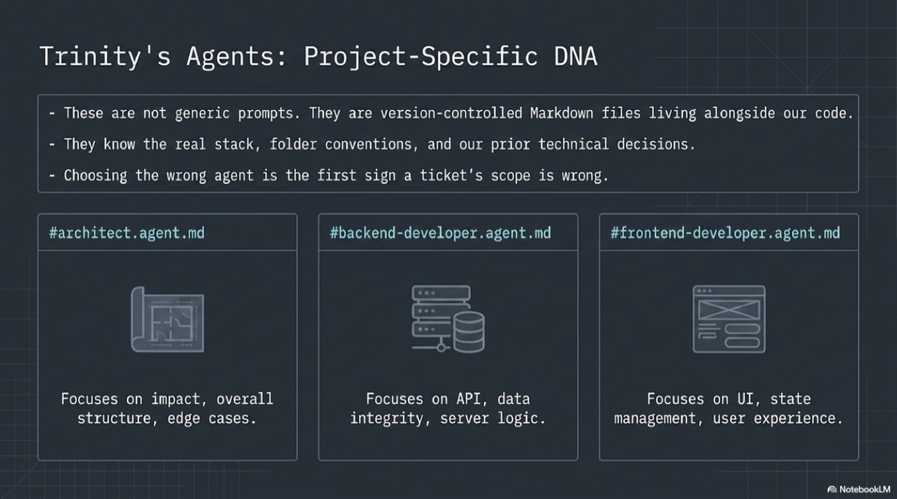

  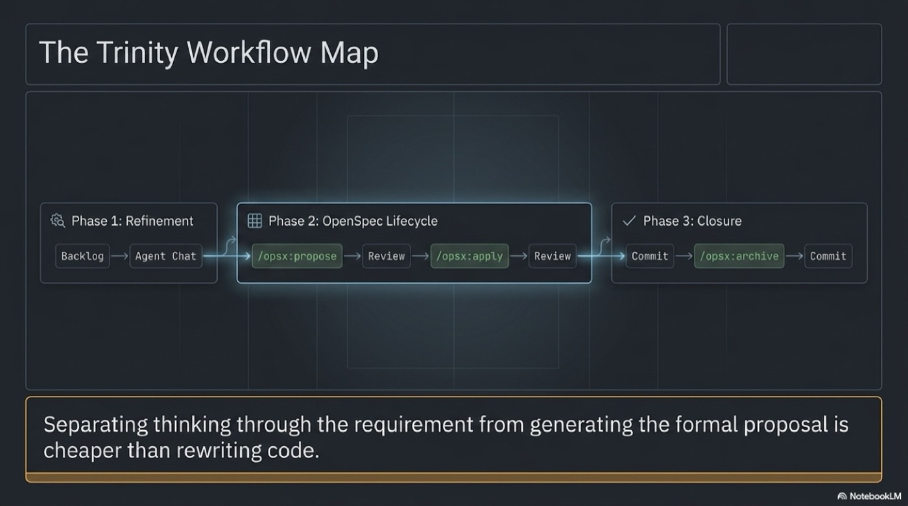

  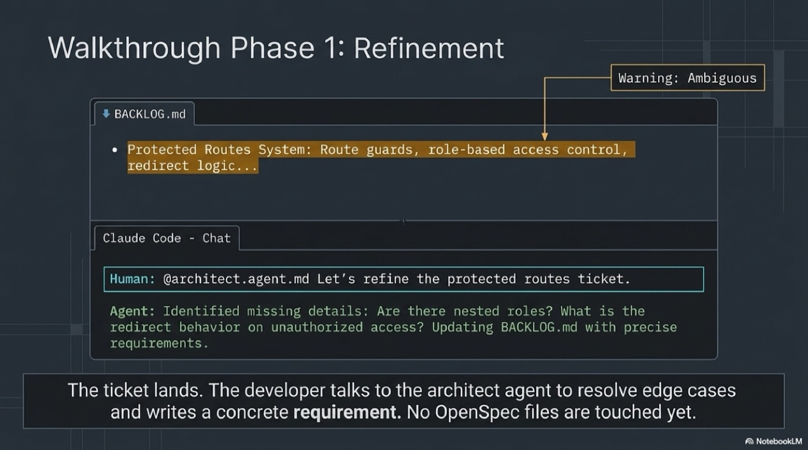

  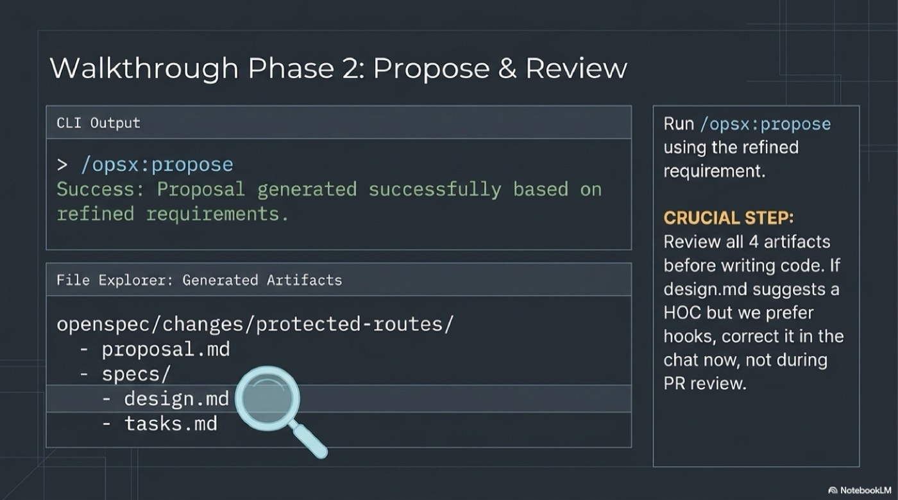

  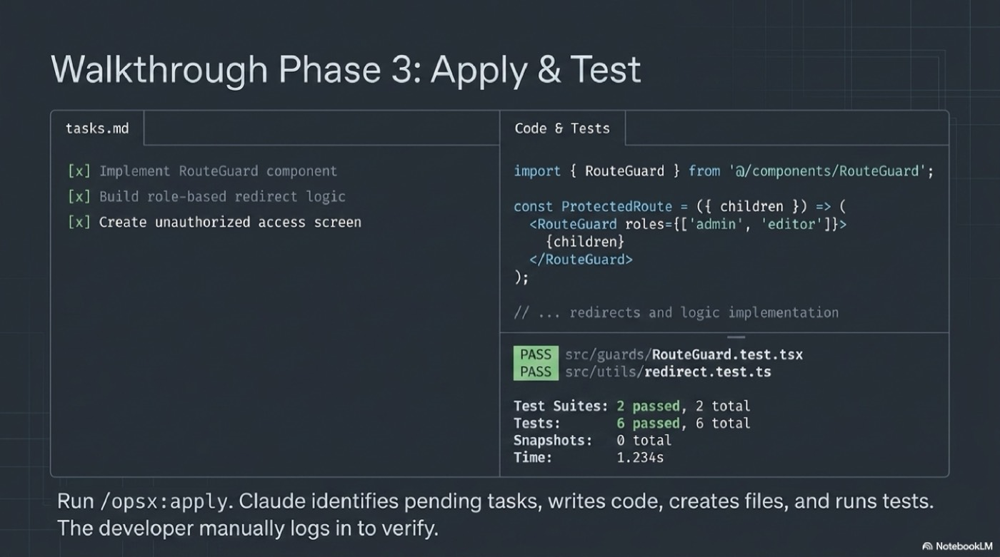

  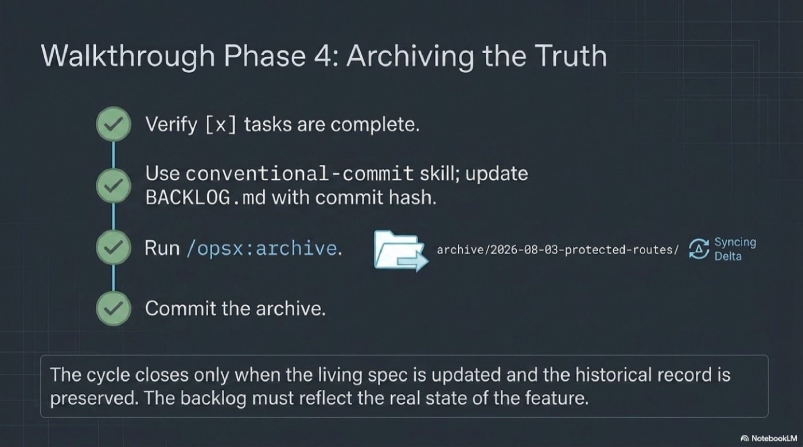

  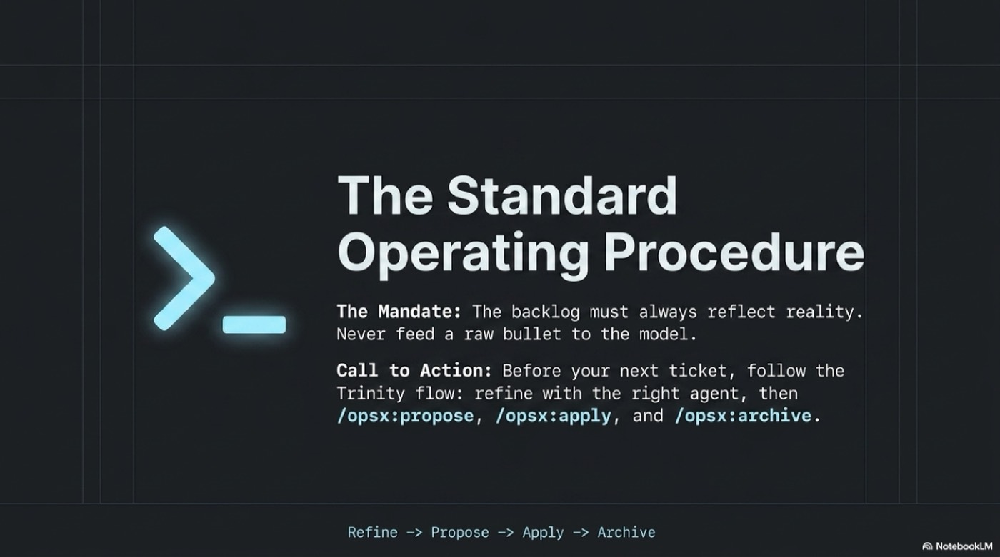

